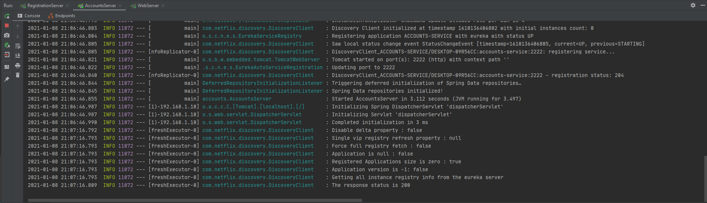

# Lab 6 - Microservices
Sergio Álvarez Peiro, 740241

### The two microservices accounts (2222) and web are running and registered (two terminals, logs screenshots).
Accounts server running:

Web server running:

### The service registration service has these two microservices registered (a third terminal, dashboard screenshots)
Registration Server running:

Eureka dashboard with the 2 services registered:

### A second accounts microservice instance is started and will use the port 4444. This second accounts (4444) is also registered (a fourth terminal, log screenshots).
To start the new accounts microservice, I copied the accounts folder, changed the port to 4444 in the application.yml file and ran it.

The result in the Eureka dashboard:

### What happens when you kill the microservice accounts (2222) and do requests to web? Can the web service provide information about the accounts again? Why?
If the accounts(2222) microservice is killed, the Eureka dashboard no longer shows 2 instances:

Now if I request the web server information about the accounts using the URI /accounts/123456789 it can still provide information because we have the other instance of the microservice running.

